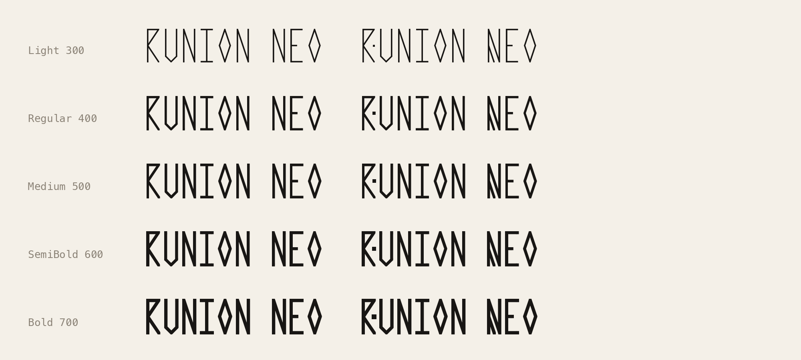

# Runion Neo

Latin and the Elder Futhark on a grid of 3 × 7 dots. Straight lines only, from any dot to any dot. Monospace, narrow and tall, every letter fills the full width of a cell.


Runion Neo is a Latin typeface built from runes. Type ordinary text and you get Latin letters. Each capital is drawn as its lowercase letter plus a rune accent. The runes have their own Unicode codepoints (ᚠᚢᚦᚨᚱᚲ…), and the font draws them too.

Runion Neo comes from [Runion Basic](https://github.com/OneManMobile/Runion-Font), which shows runes when you type Latin letters. Neo keeps Basic's grid, engine and runes. It adds a real Latin alphabet, so Latin text is Latin and runic text is runic.

To try it, open [`index.html`](index.html) or run `make serve`. The playground has a type tester (with a switch that writes your text in runes), a table of every character and a sketchpad for drawing glyphs on the dots.

Runion Neo comes in weights from Light to Bold. The variable font [`fonts/variable/RunionNeo[wght].ttf`](fonts/variable/RunionNeo%5Bwght%5D.ttf) covers every weight from 300 to 700, with named Light, Regular, Medium, SemiBold and Bold. Static Light, Regular and Bold are in [`fonts/ttf/`](fonts/ttf), and WOFF2 versions of all of them are in [`fonts/webfonts/`](fonts/webfonts). The licence is the [SIL Open Font License 1.1](OFL.txt).



## The system


The font is drawn on one grid of 3 columns and 7 rows of dots. A glyph is a list of lines between dots. Lowercase a is `00-16-20 02-22`: up from the bottom left to the top middle, down to the bottom right, and a bar across.

| Rule | What it means |
| --- | --- |
| Dot to dot | Every line starts and ends on a dot. Any dot can join any other dot, neighbour or not. There are no curves. |
| Full width | Every Latin letter and digit touches both the left and the right column. |
| One stroke | One line thickness for everything in a weight: 32 units in Light, 50 in Regular, 74 in Bold (`@light`, `@stroke`, `@bold` in the source). The dots never move between weights; only the pen changes. |
| The nib | Ink at a dot stays inside that dot's square, the nib. Corners are mitred and clipped to it, and line ends are cut flush with the grid, so every glyph has the same outer box. |
| Unicase | Lowercase and capitals are the same height. A lowercase letter is the plain letter, and its capital is the same letter with a rune accent. |
| Dots | A dot that stands free (the stung dots, the period, the umlaut) is 1.4 pens wide (`@dot`), because a small square reads lighter than a line of the same width. Where a dot that big would crowd a line, it shrinks back towards one pen. A dot that sits on a line stays one pen. |
| Marks | Accents sit outside the letter, in two rows above and two below. Every glyph fills the same box, so one mark position fits all of them. The 140 or so accented letters are composed by the build from Unicode: letter plus mark. |

### Capitals

A capital is its lowercase letter with a rune accent: an added or split stroke, or a rune's own shape. Where nothing can be added, it gets a dot.

| Capitals | Accent |
| --- | --- |
| A T | A second crossing bar, like the two arms of ansuz ᚨ: A's sits right above its own, T's below its top. |
| E | The middle line splits in two, one step up and one step down, and the old line becomes the space between them. |
| H | Dagaz ᛞ itself: the bar becomes a cross between the staves. |
| I | The bars and stem stay, and a crossbar runs through the middle. |
| P | The flag's diagonal is doubled: a second one, two steps lower, closed off at the right. |
| F | Fehu ᚠ itself. |
| K | Branches: the arms meet in the middle like kaunan ᚲ. |
| L | A second bar right above its foot. |
| M W | The cross of mannaz ᛗ. |
| Y | Algiz ᛉ: the Y with its stave continued to the top. |
| X Z | A bar across. |
| J | A short stem under the top bar, hanging free between the bar and the hook. |
| B C G O Q R U V | These have no line to add, so they get one dot, in the counter or, for B, C and R, at the middle right in the open mouth. Medieval carvers made new letters from runes the same way, with a dot: the stung runes. |
| S | Two dots, one in each counter: upper right and lower left. |
| D | Two lines from the stave, crossing inside the triangle and reaching out to the right edge. |
| N | A short branch from the middle of the first stave down to the bottom middle. |

Æ, Œ, Ð, Ø, Þ, ẞ, Ħ and Ł follow the same rules. Æ, Œ and Ð split their middle bar like E. ø is the diamond O with one slash from corner to corner; capital Ø has a cross through the middle of the diamond instead. Capital Þ is thurisaz ᚦ itself, the rune the Latin letter comes from.

Å is drawn rather than built from A and a ring: the A comes down one step and the ring becomes a dot above its tip. å has one bar, Å two, like a and A.

The lowercase letters are sharp too. O is four lines, a diamond, the same shape as ingwaz ᛜ. C is two strokes, the angle of kaunan ᚲ. G is four: C, then up to the middle and a bar inwards that stops short of the first strokes. Capital G's dot sits in the mouth above that bar. D is three strokes: a stave and a point. P is three strokes, a flag on the stave; R is P with a leg (four strokes), and B is P with the flag mirrored below. S is three strokes: from the upper right down to the middle left, across to the middle right, and down to the lower left.

All of it is defined in one text file, [`sources/glyphs.txt`](sources/glyphs.txt).

## Historical ties


The Elder Futhark is the oldest runic alphabet. It has 24 runes and was used by Germanic peoples from about the 2nd to the 8th century. The oldest securely dated inscription is the Vimose comb, from about 160 AD. The name comes from the first six runes: f, u, þ, a, r, k. The angular shapes are presumably an adaptation to cutting in wood and metal. Runion follows the same constraint.

These are not the Viking runes. The Elder Futhark belongs to the Roman Iron Age and the Migration Period, and it was already being replaced when the Viking Age began. The Vikings wrote with the Younger Futhark, which has only 16 runes, so one rune covers several sounds: ᚢ stood for u, o, v, w, y and ø, and ᚴ for k, g and ŋ. Towards the end of the Viking Age carvers started adding stung runes, a rune marked with a dot or a bar to show a second sound. By the early 13th century these medieval runes matched the Latin alphabet letter for letter. The Anglo-Saxon futhorc went the other way and added new runes.

The rune names used here (fehu, uruz, thurisaz and the rest) are scholarly reconstructions of Proto-Germanic words, worked out from later rune poems. None of them is attested in an Elder Futhark inscription.

Some of the objects the shapes come from:

- The Kylver Stone (Gotland, Sweden, c. 400) is a slab that sealed a grave. It carries the earliest known listing of all 24 runes in order.
- The Vadstena bracteate (Sweden, c. 500) is a gold pendant. It lists the row with dots dividing it into three groups of eight, the *ættir*. It was stolen from the Swedish Museum of National Antiquities in 1938 and has not been found.
- The Golden Horns of Gallehus (Denmark, early 5th century) carried one of the earliest full sentences in runes, *ek hlewagastiz holtijaz horna tawido*: "I Hlewagastiz Holtijaz made the horn". The horns were stolen in 1802 and melted down for the gold.
- Codex Runicus (c. 1300) is a law book, the Scanian Law, written entirely in medieval runes. Runes were still a working script long after the Viking Age.

### The runes in the font

All 24 Elder Futhark runes are at their own Unicode codepoints. They keep their historical structure and orientation and were checked against reference glyphs for the Unicode Runic block. A few later runes are included as well:

| Rune | Notes |
| --- | --- |
| ᚳ cen, ᚻ haegl, ᛝ ing | From the Anglo-Saxon futhorc. Haegl has two bars where hagalaz ᚺ has one. |
| ᛅ ár | The Younger Futhark a/æ rune. It developed from jera ᛃ: when Proto-Norse *\*jāra* lost its initial j, the rune's sound changed from j to a. |
| ᚯ ø, ᚧ eth, ᚡ v | Medieval stung runes: a stave struck twice, thurisaz with a bar, fehu with a dot. The reference form of ᚧ has a dot. Runion uses a bar because a dot clogs inside the bowl. |
| ᛩ q | The medieval q rune. |
| ᚨ + ◌̊ | Typing ansuz followed by a combining ring above (U+030A) gives ansuz with a third arm, for å. Fonts without this drawing show ᚨ with a ring, which means the same thing. |

The differences come from the narrow grid:

| Glyph | Status |
| --- | --- |
| ᚲ kaunan, ᛃ jera, ᛜ ingwaz | These runes have no stave, and reference charts usually draw them smaller than the rest. Here they are full height. |
| ᛒ berkanan | Two symmetric 45° bowls would need nine rows, so the bowls are steep on the outside and shallow on the inside. ᚹ wunjo and ᚱ raido use the same bowl. |
| ᛞ dagaz | A cross from corner to corner clogs at this width, so a smaller 45° cross joins the staves. |
| ᛊ sowilo | Drawn in the three-stroke form, which is more common from the 5th century on (the Gallehus horns). The older four-stroke form of the Kylver Stone is the `ss01` alternate. |

Runion is a typeface and makes no claim to be a scholarly reconstruction.

## Using the font

```css
@font-face {
  font-family: "Runion Neo";
  src: url("RunionNeo[wght].woff2") format("woff2");
  font-weight: 300 700;
}
.neo { font-family: "Runion Neo", monospace; font-weight: 300; }   /* any weight from 300 to 700 */
```

| Feature | Default | Effect |
| --- | --- | --- |
| `ccmp` | on | Draws ᚨ + U+030A as ansuz with a third arm, and a/A + U+030A as the drawn å/Å. |
| `ss01` | off | The four-stroke ᛊ of the Kylver Stone. Turn it on with `font-feature-settings: "ss01"`. |
| `mark` | on | Combining accents attach to any letter or rune. |

The font covers the Google Fonts Latin Core set (319 characters), the 24 Elder Futhark runes, the later runes above and the runic punctuation ᛫ ᛬ ᛭.

### Writing in runes

The font never turns Latin letters into runes. To write in runes, the text itself has to contain runes, so that copying, searching and screen readers get runes too. The playground's "write in runes" switch converts what you type to runic codepoints. Letter by letter it follows the Elder Futhark, `th` becomes ᚦ and `ng` becomes ᛜ, and later runes fill the gaps: ᚳ for c, ᛩ for q, ᚡ for v, ᛅ for æ and ä, ᚯ for ø and ö. For y it uses eihwaz ᛇ, the yew rune; its sound value is disputed and it was not a y. You can also type runes directly with a keyboard layout that has the Runic block.

## Building

```bash
make venv     # once: Python environment with fontmake, ufoLib2, shapely, pillow, gftools, fontbakery
make build    # glyphs.txt → UFOs → fonts/variable, fonts/ttf, fonts/webfonts, playground data
make gftools  # the Google Fonts path: gftools builder compiles fonts/ from sources/config.yaml
make proof    # contact sheet (out/) and documentation images
make test     # fontbakery, Google Fonts profile
```

`sources/glyphs.txt` is the source. `sources/build.py` turns it into three master UFOs (`sources/RunionNeo-Light.ufo`, `-Regular.ufo`, `-Bold.ufo`) and `sources/RunionNeo.designspace`, and compiles the variable font from them with fontmake. In the masters every line, corner and dot is a separate piece, so each glyph has the same points at every weight and the masters interpolate exactly. The static fonts are built from the same pieces merged into one outline. `sources/runion.py` turns the dots and lines into outlines.

The master UFOs and the designspace are committed, so the fonts can also be built without `glyphs.txt`: `sources/config.yaml` lets `gftools builder` compile the variable font and the statics from them (`make gftools`). After changing `glyphs.txt`, run `make build` first so the masters are up to date. Every push is built and checked with fontbakery by GitHub Actions; the fonts and the report are attached to each run.

To change a glyph, edit its line in `glyphs.txt` and run `make build`. The sketchpad in the playground writes the stroke code for you.

## How it was made

Runion Neo was made with AI. I worked with Claude, Anthropic's AI model, in Claude Code. I set the concept and the rules: the dot grid, full-width letters, one stroke width, the rune accents on the capitals, and specific letterforms such as A, E and H. I decided what to keep and what to change, and reviewed the results as we went. Claude drew the glyph constructions on the grid, wrote the build code and the playground, researched the history and drafted this README. No existing font data or outlines were used. Every outline is generated from `sources/glyphs.txt`.

## Licence

Copyright 2026 The Runion Neo Project Authors (https://github.com/OneManMobile/runion-neo).

This Font Software is licensed under the SIL Open Font License, Version 1.1. The licence is in [`OFL.txt`](OFL.txt) and is also available with a FAQ at https://openfontlicense.org.
